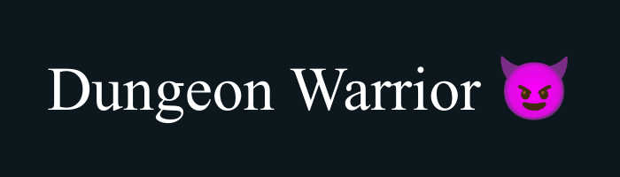

# Dungeon Warrior! ⚔️ 

Dungeon warrior is a TUI terminal game with all the integrated features of a fun fantasy game! This game originally
transpired to just be another school project, however I saw some genuine visions of what could come with creating
this game and decided to push myself, a junior C++ developer, to creating the best first terminal game that I could.

For funsies, after finishing a normal implementation of the game, I will be continuing development by integrating a
vim motions combat system similar to VimBeGood. I don't _exactly_ know how I would tackle this, I'm looking into a cross-platform
TUI library called [FTXUI](https://github.com/ArthurSonzogni/FTXUI#documentation) however I'm genuinely not sure how this project will
turn out and if I ever do decide to tackle implementing skill based vim motions combat system.

However as of **05/02/24, 7:11 CST** of writing this, I feel pretty confident on this vision.

Thanks, Dr. Dan for this project!

#### Notes :rocket:

- As of **05/02/24**, this project is <ins>**not finished!</ins> It is still in active development.

- Dungeon Warrior utilizes ANSI escape codes for color formatting in the terminal. To ensure the game displays correctly,
please make sure ANSI escape codes are enabled in your terminal emulator. Most Unix-like terminals have ANSI escape codes enabled by default.
If you're using Windows 10 or later, you may need to enable ANSI support manually in your terminal settings for optimal experience.

- I take direct contacts through discord, my discord username is currently <ins>hitcursor</ins>.

- I am genuinely open to criticism of any kind! I'm not even a junior developer, I'm just a college student haha. So please, contact me
in any way possible and leave any suggestions! :)

